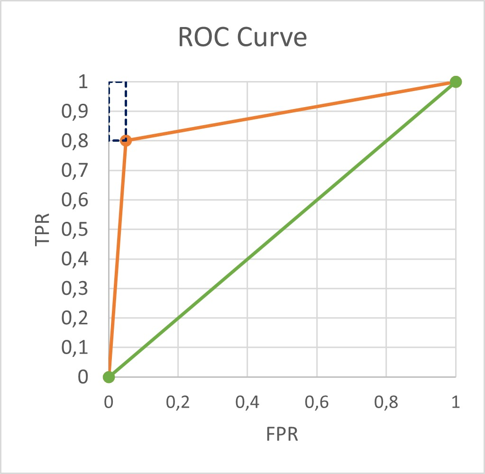
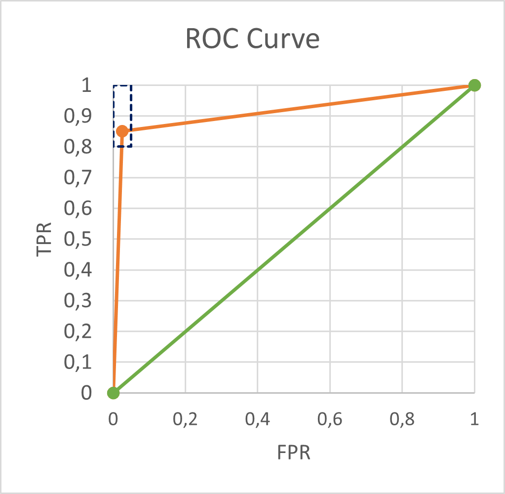

# Bussiness Understanding of the Banking Data Mining Project
The bank wants to improve their services by understanding and categoryzing them given multiple criteria, such as their credit cards issued or the loans granted to them.

## Analysis of Requirements with the End User
In order to analyse their costumers and improve the bank's future bussiness strategy, the end-user wants to solve two main problems, a descriptive and a predictive one.

### Descriptive Problem
It consists of the standardization of the bank client profiles by exploring their caractheristics, so that a distinction between trustworthy and unrealiable costumers can be made.

### Predictive Problem
It consists of predicting wether a loan will end successfully according to each client that owns the account where the loan was granted. 

This will allow the bank to better understand each client and evaluate the risk of each transaction, giving them the possibility to adapt loan conditions according to the client's profile: good clients would have a lower interest rate making the bank more attractive to future clients, and bad ones would have ajusted interest rates in proportion to their defaulting risk (more risk, higher interest rates to minimize losses). 

Some other specifities to incorporate would be denying credit to unrealiable clients by antecipating loan defaulting, and discussing a change of terms with them; automatize the client's profiling and their risk assessment in order to speed up the loan application process; and overall, aid the decision making process by the bank's employees.

## Definition of Business Goals 

The core bussiness goal would be to develop a predictive information system that aids the bank in achieving:

* **Reduction of the amount of 'bad loans' granted**:
    Keep false negative rates bellow 20% and true positive rates above 80%, so that we can reduce the amount of 'bad loans' granted by 80%, showcasing the real impact of our system apllied in the bank.

* **Stability in loan crediting to reliable clients**:
    Keep false negative rates bellow 5% and true positive rates above 95%, so that the amount of loans credited to reliable clients is at least 95%, in order to guarantee that no valuable clients are lost.

## Translation of Business Goals into Data Mining Goals

Our bussiness goals, as specified before, should meet the following criteria:
* False Positive Rate (FPR) < 0.05%
* True Positive Rate (TPR) > 80.0%

The ROC curve should then fall under the area defined by the previous conditions, at least in some point, with width of 0.05 and height of 0.20, represented in the figures by the blue box with intermitent lines.

The minimum AUC value to meet the threshold expected would be 0.90 since it considers values from (0,0) to (0.05, 0.80) and then to (1,1). The quality of the results with that threshold will be reasonable.

Therefore, the ideal AUC value would be 0.9125, considering the vertex is inside the criteria area in (0.025, 0.85). The quality of the results with that threshold will be very good.

Reasonable Threshold       |  Good Threshold
:-------------------------:|:-------------------------:
       |  