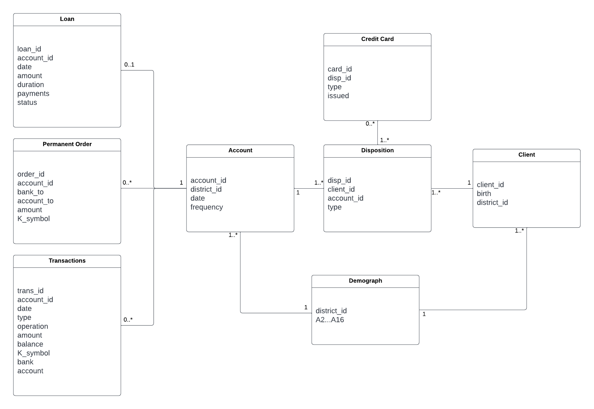

## Aula 1
Organizamos os dados fornecidos com recurso a um diagrama UML:


Analisamos os dados e incongruências face à descrição do trabalho apresentada:
- Na relação "Loan" o atributo status que é descrito como tomando os valores "A,B,C,D" apresenta apenas 1 ou -1.
- Na relação "Disposition" o atributo type é descrito como tomando os valores "Owner, User" apresenta apenas "Owner" ou "Disponent".

## Aula 2
Continuamos com a analise dos dados e da sua preparação:
- O atributo "birth_number" da relação "Client" deve ser divido em duas colunas, uma para o género e outra para a data de nascimento do cliente.
- O atributo "status" da relação "Loan" foi alterado no caso de ser '-1' para '0'.
- Na relação "Transaction" observamos que os atributos "operation", "k_symbol", "bank" e "account" tẽm valores não definidos.

Fizemos uma previsão inicial do resultado usando apenas a relação "Loan" com 20% de dados de teste, recorrendo ao algoritmo de Random Forest e obtemos os seguintes resultados:

```
Confusion Matrix:

[[ 2  7]
 [ 4 53]]

Report:
              precision    recall  f1-score   support

           0       0.33      0.22      0.27         9
           1       0.88      0.93      0.91        57

    accuracy                           0.83        66
   macro avg       0.61      0.58      0.59        66
weighted avg       0.81      0.83      0.82        66
```

## IT1
 - Logistic Regression on table trans
 - Linear Regression on table district
 - Columns dropped based on correlation 95

## IT1
 - Remove Regression on table trans
 - Linear Regression on table district
 - Columns dropped based on correlation 95

## IT3
 - Wrapper based methods for column selection 


## IT4
 - Filter on 85% rather than 95%

## IT5 remove outliers
